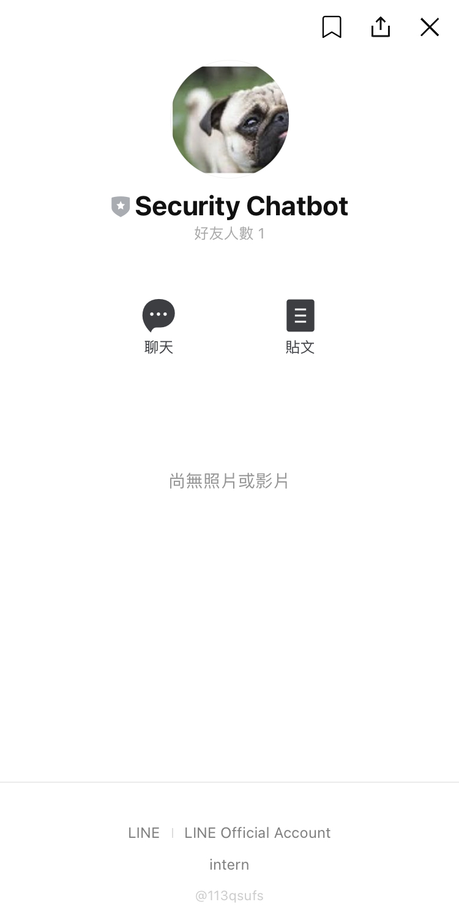
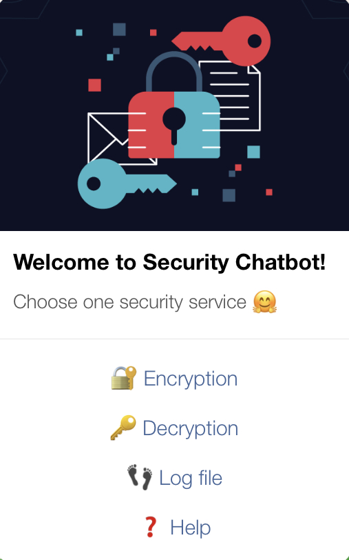

# A LINE security chatbot

### Demo

[video](https://www.youtube.com/embed/YFZUAvOvXSo)

### Detailed Introduction

[slides](https://drive.google.com/file/d/15sn7H7yz3tOkQtyd9VRcueIfKJu6rWB8/view?usp=sharing)

### QR code


### Inroduction

A LINE chatbot build-up for RSA encryption & decryption services.



### Functions



- **Encryption**: type _"$$message$$"_, then the encrypted message will be sent back, and be stored into database

- **Decryption**: type _"@@message@@"_, then the decrypted message will be sent back, and be stored into database

- **Log file**

  * **View**: view the last 5 historical encryption or decryption records (personal info only)
  
  * **Clean**: clean all individual historical records in the database (other users' information is remained)
  
- **Help**: show the description of functions


### Settings

- [LINE developer account](https://developers.line.biz/console/) [1, 2]

- [Heroku account](https://dashboard.heroku.com/apps) [1, 2]

- [ngrok download](https://ngrok.com/) [3]

### Implementations

```shell
$ git clone https://github.com/tinganchen/security-line-chatbot.git
```

#### 1. Security Chatbot on pandas dataframe + Heroku

- Requirements

  * python-3.9.6 (default in Heroku v20 environment)
 
  * other packages (see _chatbot-df/requirements.txt_)


- Move to directory _chatbot-df/_

```shell
$ cd chatbot-df/
```

- Fill in your LINE **_channel access token_** & **_channel secret_** in L18 & L20 in app.py

- Run app.py

```shell
$ python3 app.py
```
- Create a new app on Heroku & name your <Heroku_app_name> (see [2])

- Log in Heroku & upload and build the project through git commands
  
```shell
$ heroku login
$ git init
$ heroku git:remote -a <Heroku_app_name>
$ git add .
$ git commit -am 'upload'
$ git push -f heroku master
```
- Now the project is built. 
  
- Copy the deployment url with /callback: **_https://<Heroku_app_name>.herokuapp.com/callback_** 

- Paste as LINE **Webhook URL** & **verify** (see [2]) 
  
- Scan the chatbot **QR code** (see [2]) 

- Can start interacting with the chatbot in the LINE chat room

  
#### 2. Security Chatbot on Spark database + ngrok

- Requirements

  * python-3.6.14 (see _chatbot-spark/runtime.txt_)
 
  * other packages (see _chatbot-spark/requirements.txt_)


- Move to directory _chatbot-spark/_

```shell
$ cd chatbot-spark/
```
- Fill in your LINE **_channel access token_** & **_channel secret_** in L18 & L20 in _app.py_

- Run _app.py_

```shell
$ python3 app.py
```
- Run ngrok

```shell
$ cd <directory where ngrok downloaded>
$ ./ngrok http 5000
```

- Copy the forwarding url with /callback: **_https://<ngrok_random_string>.ngrok.io/callback_**

- Paste as LINE **Webhook URL** & **verify** (see [2]) 

- Scan the chatbot **QR code** (see [2]) 

- Can start interacting with the chatbot in the LINE chat room


### Issues
  
Spark on Heroku.

  
### Reference

- [1] LINE official: https://github.com/line/line-bot-sdk-python

- [2] GitHub tutorial: https://github.com/yaoandy107/line-bot-tutorial?fbclid=IwAR0mGh2jSmQgSUGj9YG1JmvxnkhbtyzguP1IQCgJtxYA9VzDy_e2zmwhTxA

- [3] Blog: ngrok-webhook https://learn.markteaching.com/ngrok-webhook/?fbclid=IwAR1wSIvOFePpGXo7ZghRNiCgujMVAlZ1CnQNrSEe1g4ue3SGv_8cT8wGC1o
